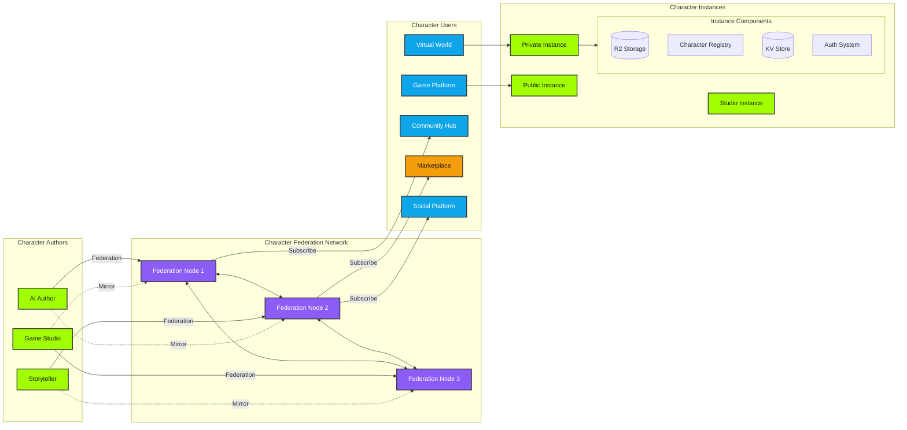
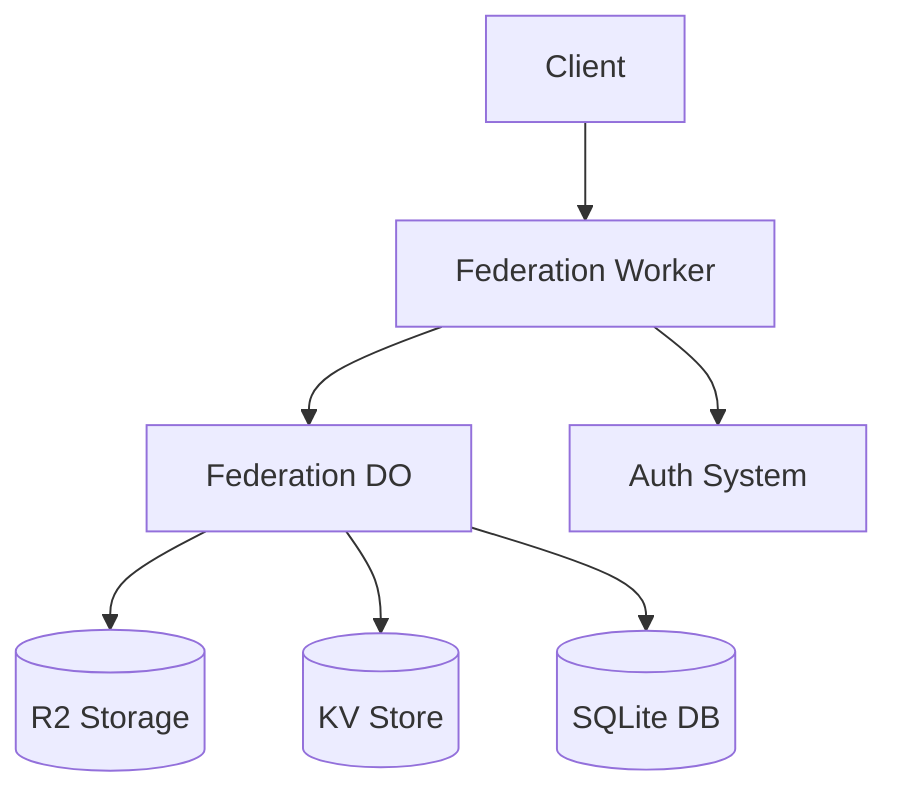

# Character Federation Network (CFN) - ⚠️ BETA - USE WITH CAUTION ⚠️

A decentralized character distribution network that enables sharing of AI characters across independent instances while maintaining character ownership and authenticity.



## Overview

The Character Federation Network (CFN) is a decentralized system that enables AI character authors and publishers to distribute their characters while maintaining control and authenticity. Built on Cloudflare Workers and Durable Objects, CFN provides:

- Decentralized character distribution
- Character ownership verification
- Secure character data mirroring
- Version control and updates
- Activity monitoring
- Health checks
- Cross-instance synchronization

## Prerequisites

Before setting up a federation node, ensure you have:

- A Cloudflare account with Workers and R2 enabled
- Character Publisher instance with federation support
- Wrangler CLI installed
- Node.js 18 or later
- OpenAI API key (for character model support)
- Anthropic API key (optional, for Claude model support)

## Quick Start

1. Deploy federation node:
```bash
git clone YOUR_REPO_URL
cd character-federation
npm install
npx wrangler deploy
```

2. Generate Ed25519 keys:
```bash
node -e "
const crypto = require('crypto');
const { privateKey, publicKey } = crypto.generateKeyPairSync('ed25519');
console.log('Private:', privateKey.export({type: 'pkcs8', format: 'pem'}));
console.log('Public:', publicKey.export({type: 'spki', format: 'pem'}));
"
```

3. Configure worker:
```bash
# Add signing keys
wrangler secret put FEDERATION_PRIVATE_KEY
wrangler secret put FEDERATION_PUBLIC_KEY

# Add API keys
wrangler secret put OPENAI_API_KEY
wrangler secret put ANTHROPIC_API_KEY

# Set master admin key
wrangler secret put MASTER_KEY
```

4. Create admin access:
```bash
curl -X POST https://your-federation.workers.dev/federation/create-admin-key \
  -H "Authorization: Bearer YOUR_MASTER_KEY" \
  -H "Content-Type: application/json" \
  -d '{"description": "Admin Console"}'
```

## Architecture

The federation system consists of:



### Components

1. **Federation Worker**
   - Request routing
   - Authentication
   - Rate limiting
   - Cache management

2. **Federation DO**
   - Character registry management
   - Source verification
   - Sync coordination
   - State management

3. **Storage Layer**
   - R2: Character data and assets
   - KV: API keys and temp data
   - SQLite: Federation state

## API Endpoints

### Admin Endpoints
- `POST /federation/create-admin-key`
- `GET /federation/sources`
- `POST /federation/add-source`
- `POST /federation/verify-source`
- `GET /federation/activity`

### Character Management
- `GET /federation/characters`
- `GET /federation/character/{id}`
- `POST /federation/sync-characters`
- `GET /federation/version-check`

### Source Management  
- `POST /federation/update-source`
- `POST /federation/subscribe`
- `GET /federation/source-status`

## Database Schema

### Sources
```sql
CREATE TABLE sources (
    id TEXT PRIMARY KEY,              
    instance_url TEXT NOT NULL,
    username TEXT NOT NULL,
    public_key TEXT NOT NULL,
    status TEXT DEFAULT 'pending',    
    trust_score FLOAT DEFAULT 0.0,
    created_at INTEGER DEFAULT (unixepoch()),
    last_sync INTEGER,
    UNIQUE(instance_url, username)
);
```

### Federated Characters 
```sql
CREATE TABLE federated_characters (
    id INTEGER PRIMARY KEY AUTOINCREMENT,
    character_id TEXT NOT NULL,
    source_id TEXT NOT NULL,
    name TEXT NOT NULL,
    slug TEXT NOT NULL,
    model_provider TEXT NOT NULL,
    bio TEXT,
    settings TEXT,
    vrm_url TEXT,
    profile_img TEXT,
    banner_img TEXT,
    status TEXT DEFAULT 'private',
    version TEXT NOT NULL,
    signature TEXT NOT NULL,
    mirror_date INTEGER DEFAULT (unixepoch()),
    FOREIGN KEY(source_id) REFERENCES sources(id)
);
```

### Character Versions
```sql
CREATE TABLE character_versions (
    id INTEGER PRIMARY KEY AUTOINCREMENT,
    character_id TEXT NOT NULL,
    source_id TEXT NOT NULL,
    old_version TEXT NOT NULL,
    new_version TEXT NOT NULL,
    updated_at INTEGER DEFAULT (unixepoch()),
    FOREIGN KEY(source_id) REFERENCES sources(id)
);
```

## Configuration

Example wrangler.toml:
```toml
name = "character-federation"
main = "src/index.js"
compatibility_date = "2024-10-22"

[[durable_objects.bindings]]
name = "FEDERATION"
class_name = "FederationDO"

[[migrations]]
tag = "v1"
new_classes = ["FederationDO"]

[[r2_buckets]]
binding = "FEDERATION_BUCKET"
bucket_name = "federated-characters"

[[kv_namespaces]]
binding = "FEDERATION_KV"
id = "..."
```

## Security 

### API Keys
- Admin keys prefixed with `fadmin_`
- Regular key rotation required
- Keys stored encrypted in KV
- Master key for initial setup

### Character Privacy
- Private/public status control
- Encrypted storage of sensitive data
- Model API key isolation
- Access control per source

### Source Verification
- Ed25519 signature validation
- Challenge-response verification
- Regular health monitoring
- Trust score system

## Best Practices

1. **Source Management**
   - Verify sources regularly
   - Monitor trust scores
   - Track activity feed
   - Review sync status

2. **Character Updates**
   - Version all changes
   - Validate signatures
   - Test model compatibility
   - Monitor usage metrics

3. **Network Health**
   - Check node status
   - Maintain backups
   - Monitor performance
   - Regular security audits

## Troubleshooting

Common issues and solutions:

1. **Source Verification Failed**
   - Check source health status
   - Verify public key format
   - Confirm challenge response
   - Review error logs

2. **Sync Issues**
   - Check source availability
   - Verify network connectivity
   - Review rate limits
   - Check storage space

3. **Character Access Errors**
   - Verify character permissions
   - Check model API keys
   - Review subscription status
   - Check signature validity

## Contributing

While in beta, the project is not accepting external contributions. Documentation and testing feedback is welcome.
